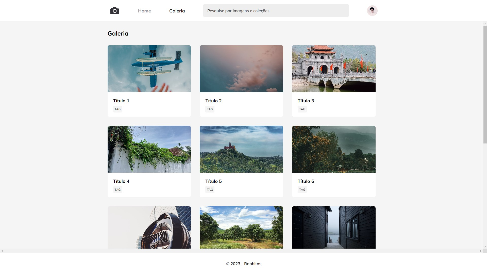

<h1 align="center"> Project Fotoblog </h1>

Projeto de um blog de imagens 

  <a href="#-tecnologias">Tecnologias</a>&nbsp;&nbsp;&nbsp;|&nbsp;&nbsp;&nbsp;
  <a href="#-projeto">Projeto</a>&nbsp;&nbsp;&nbsp;|&nbsp;&nbsp;&nbsp;
  <a href="#memo-licença">Licença</a>

 

  

## 🚀 Tecnologias

Esse projeto foi desenvolvido com as seguintes tecnologias:

- HTML e CSS
- Git e Github
- Figma

## 💻 Projeto

Projeto feito afim de aprimorar habilidades com animação e display grid no css.

- [Visite meu projeto online](https://raphetes.github.io/Fotoblog)

---

Feito por Raphael Melo Como projeto da RocketSeat! [Participe da comunidade da RocketSeat no discord!](https://discord.com/invite/rocketseat)
